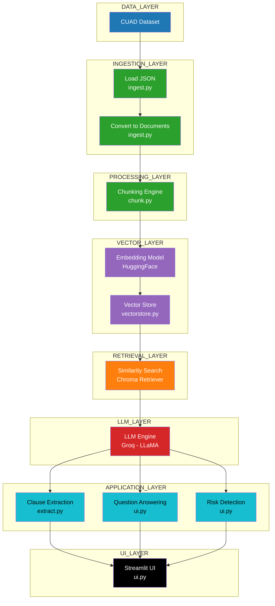

# Contract AI Engine

An AI-powered system to analyze legal contracts using Retrieval-Augmented Generation (RAG).
The system can extract clauses, answer questions, and detect risks from real-world legal contracts.

---
## Tech Stack

  
  
  
  
  

## Project Status

  
  
  

---
## Features

| Feature | Description |
|--------|------------|
| Clause Extraction | Extract 10+ legal clause categories |
| Q&A | Ask natural language questions |
| Risk Detection | Identify legal red flags |
| Source Tracking | Exact paragraph reference |
| Interactive UI | Streamlit-based interface |

---

## Problem Statement

Legal contracts are long and complex documents. Important clauses are often buried inside large text and expressed in different ways. Manual analysis is time-consuming and error-prone. 

This system solves that by automating the extraction and analysis process, allowing legal professionals to focus on high-level decision-making.

---

## Architecture Overview

### How to Run

### 1. Clone the repository

git clone https://github.com/Aftab0904/contract-clause-analysis.git
cd contract-ai-engine  

### 2. Create virtual environment

python -m venv venv  
venv\Scripts\activate  

### 3. Install dependencies

pip install -r requirements.txt  

### 4. Setup environment variables

Create a `.env` file in the root directory:

GROQ_API_KEY=your_api_key_here  
LANGCHAIN_API_KEY=your_langsmith_key  
LANGCHAIN_TRACING_V2=true  

### 5. Run the application

streamlit run app/ui.py  

## Key Design Decisions

1. RAG Architecture  
Used Retrieval-Augmented Generation to ensure answers are grounded in contract data instead of hallucination.

2. Chunking Strategy  
Contracts are split into smaller chunks to handle long documents and improve retrieval accuracy.

3. Embedding-based Retrieval  
Semantic search is used instead of keyword matching to handle variation in legal language.

4. Contract-level Filtering  
Metadata-based filtering ensures queries are answered for a selected contract only.

5. Few-shot Prompting  
Examples are added in prompts to improve clause extraction accuracy.

6. Source Tracking  
Each output includes source location (contract and paragraph) for explainability.

## Limitations and Failure Modes

- Retrieval quality depends on chunking and embeddings
- Some clauses may not be detected if phrasing is highly different
- Performance may slow down with larger datasets
- LLM responses may vary slightly due to non-deterministic behavior

## Future Improvements

- Add re-ranking for better retrieval accuracy
- Support full dataset (510 contracts) with optimized indexing
- Add evaluation metrics such as precision and recall
- Improve UI with highlighted clauses
- Add multi-contract comparison

## Tech Stack

- Python  
- Streamlit  
- LangChain  
- ChromaDB  
- HuggingFace Embeddings  
- Groq LLM  

---

## Dataset

CUAD (Contract Understanding Atticus Dataset)

- 510 real contracts  
- 41 clause categories  
- Sourced from SEC EDGAR filings  

---
## Key Learnings

- RAG system design  
- Prompt engineering  
- Retrieval optimization  
- LLM evaluation techniques  

---
## Conclusion

This project demonstrates how AI can simplify legal document analysis using RAG pipelines, enabling faster and more accurate contract understanding.

---
## Demo

  
  

  
  

